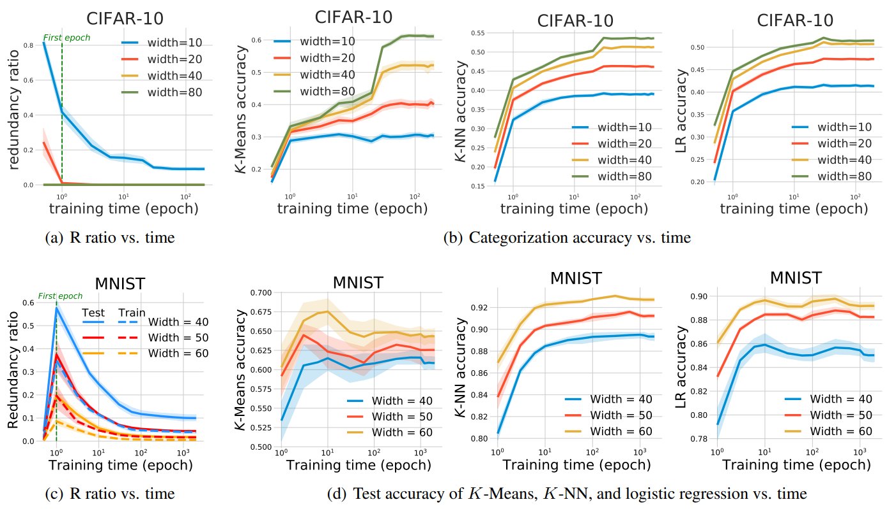

## Neural networks behave as hash encoders: An empirical study
This repository contains the code for paper "[Neural networks behave as hash encoders: An empirical study](https://openreview.net/pdf?id=8nXkyH2_s6)"

### Citation
```
@misc{he2021neural,
      title={Neural networks behave as hash encoders: An empirical study}, 
      author={Fengxiang He and Shiye Lei and Jianmin Ji and Dacheng Tao},
      year={2021},
      eprint={2101.05490},
      archivePrefix={arXiv},
      primaryClass={cs.LG}
}
```

### Experimental results
- Model capacity


- Training time


- Sample size


### Usage
#### Dependencies
- Python3.6
- Tensorflow1.9
- Keras2.2
- MNIST dataset
- CIFAR-10 dataset

#### Train
##### 1. Model capacity
- For MNIST: `python run_layer_width_train_mlp.py --dataset mnist --depth 1 --begin_repeat 1 --repeat 10`
- For CIFAR-10: `python run_layer_width_train_mlp.py --dataset cifar10 --depth 5 --begin_repeat 1 --repeat 10`

##### 2. Sample size
- For MNIST: `python run_sample_size_train_mlp.py --dataset mnist --depth 1 --begin_repeat 1 --repeat 10`
- For CIFAR-10: `python run_sample_size_train_mlp.py --dataset cifar10 --depth 5 --begin_repeat 1 --repeat 10`

##### 3. Training time
- For MNIST: `python run_training_time_train_mlp.py --dataset mnist --depth 1 --begin_repeat 1 --repeat 10`
- For CIFAR-10: `python run_training_time_train_mlp.py --dataset cifar10 --depth 5 --begin_repeat 1 --repeat 10`

#### Compute and evaluate encoding properties
##### 1. Model capacity
- For MNIST: `python run_layer_width_encoding_properties.py --dataset mnist --depth 1 --begin_repeat 1 --repeat 10`
- For CIFAR-10: `python run_layer_width_encoding_properties.py --dataset cifar10 --depth 5 --begin_repeat 1 --repeat 10`

##### 2. Sample size
- For MNIST: `python run_sample_size_encoding_properties.py --dataset mnist --depth 1 --begin_repeat 1 --repeat 10`
- For CIFAR-10: `python run_sample_size_encoding_properties.py --dataset cifar10 --depth 5 --begin_repeat 1 --repeat 10`

##### 3. Training time
- For MNIST: `python run_training_time_encoding_properties.py --dataset mnist --depth 1 --begin_repeat 1 --repeat 10`
- For CIFAR-10: `python run_training_time_encoding_properties.py --dataset cifar10 --depth 5 --begin_repeat 1 --repeat 10`

### Well-trained model

we also provide several well-trained models in our paper. If you need them, you can sent an e-mail to me: leishiye@gmail.com


