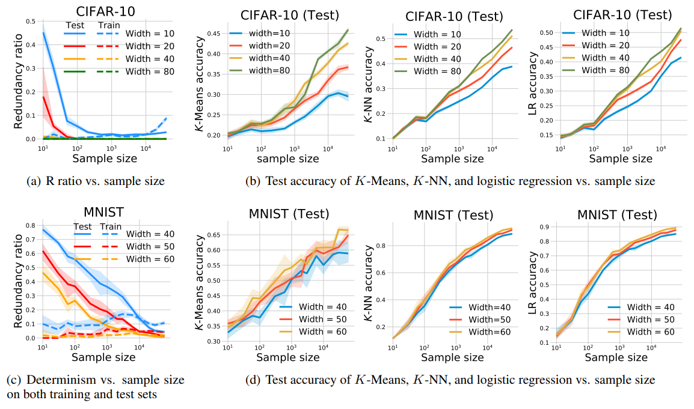

# Neural networks behave as hash encoders: An empirical study
This repository contains the code for the paper "[Neural networks behave as hash encoders: An empirical study](http://arxiv.org/abs/2101.05490)" by Fengxiang He, Shiye Lei, Jianmin Ji, and Dacheng Tao.

## Experimental results
- **Model capacity**


- **Training time**


- **Sample size**


## Instructions
### Dependencies
- Python3.6
- Tensorflow1.9
- Keras2.2
- MNIST dataset
- CIFAR-10 dataset

### Training
##### 1. Model capacity
- For MNIST: `python run_layer_width_train_mlp.py --dataset mnist --depth 1 --begin_repeat 1 --repeat 10`
- For CIFAR-10: `python run_layer_width_train_mlp.py --dataset cifar10 --depth 5 --begin_repeat 1 --repeat 10`

##### 2. Sample size
- For MNIST: `python run_sample_size_train_mlp.py --dataset mnist --depth 1 --begin_repeat 1 --repeat 10`
- For CIFAR-10: `python run_sample_size_train_mlp.py --dataset cifar10 --depth 5 --begin_repeat 1 --repeat 10`

##### 3. Training time
- For MNIST: `python run_training_time_train_mlp.py --dataset mnist --depth 1 --begin_repeat 1 --repeat 10`
- For CIFAR-10: `python run_training_time_train_mlp.py --dataset cifar10 --depth 5 --begin_repeat 1 --repeat 10`

### Compute and evaluate encoding properties
##### 1. Model capacity
- For MNIST: `python run_layer_width_encoding_properties.py --dataset mnist --depth 1 --begin_repeat 1 --repeat 10`
- For CIFAR-10: `python run_layer_width_encoding_properties.py --dataset cifar10 --depth 5 --begin_repeat 1 --repeat 10`

##### 2. Sample size
- For MNIST: `python run_sample_size_encoding_properties.py --dataset mnist --depth 1 --begin_repeat 1 --repeat 10`
- For CIFAR-10: `python run_sample_size_encoding_properties.py --dataset cifar10 --depth 5 --begin_repeat 1 --repeat 10`

##### 3. Training time
- For MNIST: `python run_training_time_encoding_properties.py --dataset mnist --depth 1 --begin_repeat 1 --repeat 10`
- For CIFAR-10: `python run_training_time_encoding_properties.py --dataset cifar10 --depth 5 --begin_repeat 1 --repeat 10`

## Well-trained model

For the well-trained models in our paper, please kindly contact Shiye Lei at [leishiye@gmail.com](mailto:leishiye@gmail.com).

## Citation
```
@article{he2021neural,
  title={Neural networks behave as hash encoders: An empirical study},
  author={He, Fengxiang and Lei, Shiye and Ji, Jianmin and Tao, Dacheng},
  journal={arXiv preprint arXiv:2101.05490},
  year={2020}
}
```

## Contact

For any issue, please kindly contact

Fengxiang He: [fengxiang.f.he@gmail.com](mailto:fengxiang.f.he@gmail.com)  
Shiye Lei: [leishiye@gmail.com](mailto:leishiye@gmail.com)  
Jianmin Ji: [jianmin@ustc.edu.cn](mailto:jianmin@ustc.edu.cn)  
Dacheng Tao: [dacheng.tao@sydney.edu.au](mailto:dacheng.tao@sydney.edu.au)

---

Last update: Sun 24 Jan 2021
